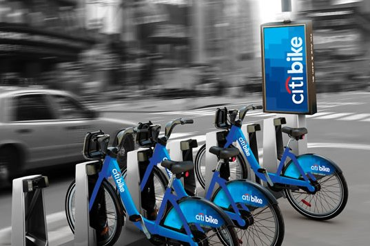
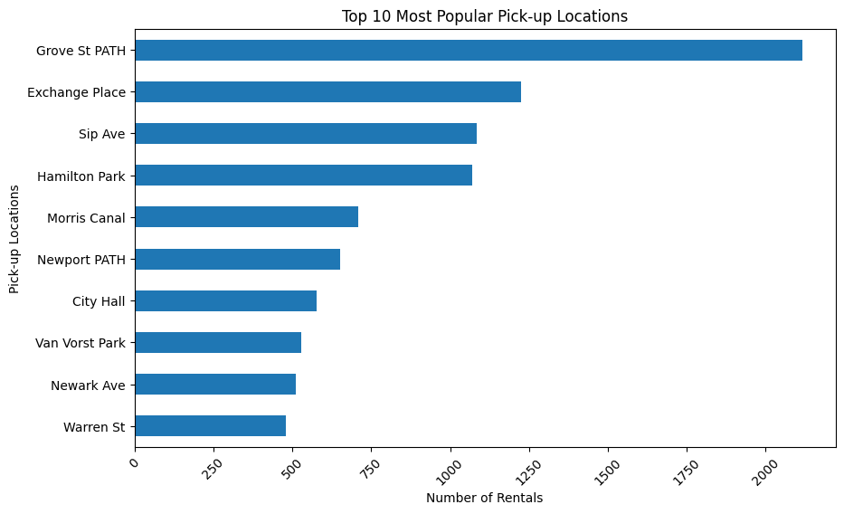
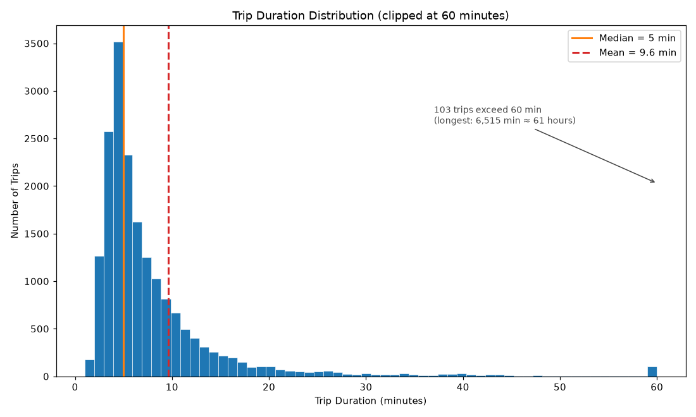
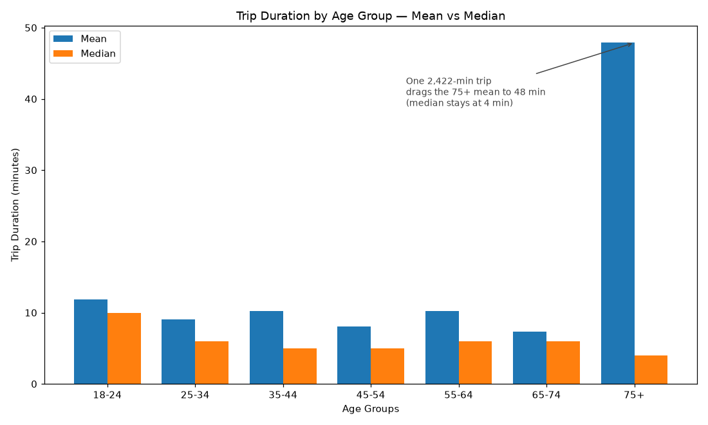
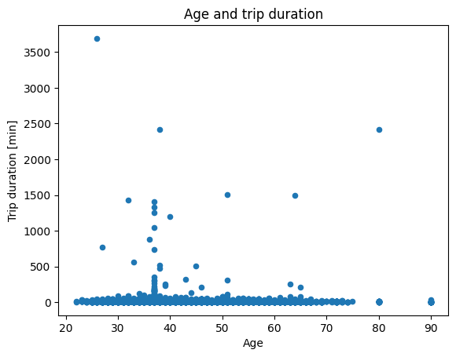
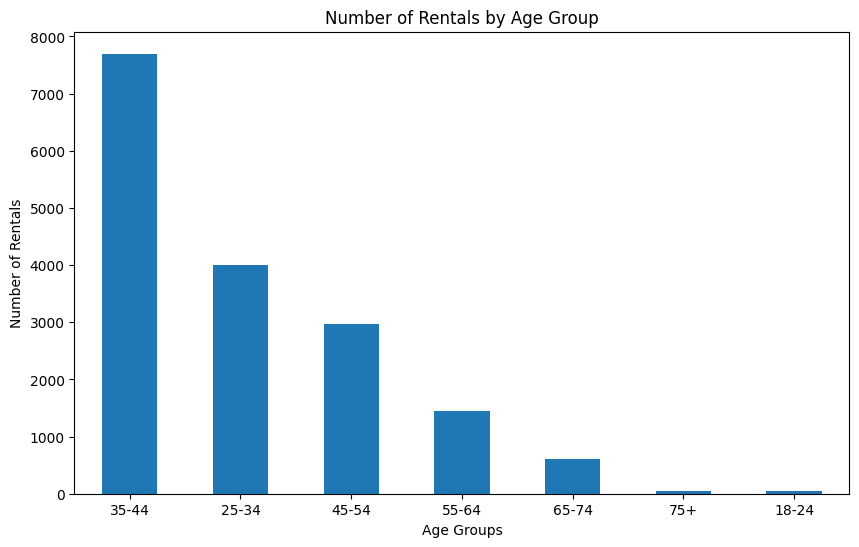
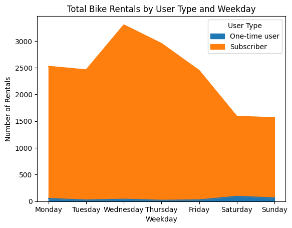

<p align="center">
  
</p>

# NYC Citi Bike — Demand & Rider Behaviour Analysis

> **What can 18,449 bike rides tell us about how people actually use a bike-share system?**

[](https://www.python.org/)
[](https://pandas.pydata.org/)
[](https://matplotlib.org/)
[](https://jupyter.org/)

[View the analysis notebook](notebook.ipynb) · [Jump to key findings](#a-few-things-stood-out) · [Run it locally](#run-the-analysis)

I analysed one year of Citi Bike data from the Jersey City service area to look at demand, rider behaviour, trip duration and a few assumptions that the data might tempt us to make.

The supplied learning extract contains **20,400 records**, which became **18,449 trips** after exact deduplication and removal of incomplete rows. It covers **50 stations and 500 bikes** from January to December 2017.

All figures in this case study and notebook use the same 18,449-row analysis frame. Long-duration records are retained and examined rather than silently deleted.

---

## A few things stood out

### 98.1% of trips are made by subscribers

Citi Bike looks much more like everyday transportation than a weekend leisure service.

Average weekday demand is around **75% higher than weekend demand** — 3,003 vs 1,716 trips per day.

Wednesday is the busiest day with **3,633 trips**.

---

### Demand is concentrated around a few stations

The busiest stations are:

| Station        | Trips |
| -------------- | ----: |
| Grove St PATH  | 2,319 |
| Exchange Place | 1,342 |
| Hamilton Park  | 1,185 |
| Sip Ave        | 1,184 |
| Morris Canal   |   768 |

Grove St PATH alone accounts for **12.6% of all trips**.

The top three stations account for roughly **26% of total demand**.

There's also a pattern worth testing: Grove St PATH and Exchange Place are PATH train stations, while Newport PATH appears near the top.

This is consistent with Citi Bike being used for the **first or last part of a commute**, but station totals alone cannot confirm that explanation. Hourly origin–destination flows would be needed to test it.

It suggests that equal bike allocation may not match demand. A rebalancing decision would still require station capacity and bike-availability data.



Worth noting that Hamilton Park and Sip Ave are separated by a single trip — 1,185 against 1,184. Below the top two, that ordering is effectively a tie.

---

## Trip duration is not normally distributed

The average trip is **9.6 minutes**.

The median is **5 minutes**.

That's a pretty big difference.

| Metric  |  Duration |
| ------- | --------: |
| Mean    |   9.6 min |
| Median  |     5 min |
| Minimum |     1 min |
| Maximum | 6,515 min |

The longest trip lasted more than **108 hours**.

There are **103 trips longer than one hour**.

That doesn't necessarily mean 103 people decided to go on extremely long bike rides. Some may be genuine; others may reflect return or data-quality issues. This extract cannot distinguish between them.

The important part is that a handful of extreme values can have a big effect on the average.

So when looking at trip duration, **the median tells us much more about the typical ride than the mean does.**



---

## Then there is the 75+ group

This is where the data gets interesting.

At first glance, riders aged 75+ look like they take dramatically longer trips than everyone else:

| Age   |         Mean |    Median | Trips |
| ----- | -----------: | --------: | ----: |
| 18–24 |     11.9 min |    10 min |    56 |
| 25–34 |      9.0 min |     6 min | 4,434 |
| 35–44 |     10.3 min |     5 min | 8,377 |
| 45–54 |      8.1 min |     5 min | 3,238 |
| 55–64 |     10.2 min |     6 min | 1,600 |
| 65–74 |      7.4 min |     6 min |   687 |
| 75+   | **47.9 min** | **4 min** |    57 |

The average says **47.9 minutes**.

The median says **4 minutes**.

So what's going on?

One ride.

A single **2,422-minute trip** accounts for **88.8% of all minutes logged by the 75+ group**.

Remove that one row and their average drops from **47.9 minutes to 5.5 minutes**.

And 54 of their 57 trips lasted less than 10 minutes.



So depending on which statistic you look at, you could tell two completely different stories:

> *"Older riders take much longer trips."*

or

> *"Older riders have the shortest median trip duration."*

The second one is much closer to what is actually happening.

---

## Age doesn't explain trip duration

The correlation between age and trip duration is:

**r = -0.002**

Basically zero.

The scatter plot tells the same story: there is a dense band of short trips across almost every age, with some extreme values scattered around it.



So there isn't much evidence here that **age is a useful predictor of how long someone rides**.

---

## Who actually uses the system?

The rider base is heavily concentrated between 25 and 54.

**87% of all trips** come from this age range.

The 35–44 group alone accounts for **8,377 trips**.

At the other end, riders under 25 account for only **56 trips**, or 0.3% of the dataset.



That's interesting, but the data doesn't tell us *why*.

It could be pricing, awareness, demographics, availability, sampling or something else entirely.

I'd treat it as a question worth investigating, not as an explanation.

---

## Weekdays vs weekends

The weekday/weekend split is pretty clear:

| Day       | Subscriber | One-time |     Total |
| --------- | ---------: | -------: | --------: |
| Monday    |      2,715 |       57 |     2,772 |
| Tuesday   |      2,647 |       30 |     2,677 |
| Wednesday |      3,590 |       43 | **3,633** |
| Thursday  |      3,239 |       20 |     3,259 |
| Friday    |      2,645 |       30 |     2,675 |
| Saturday  |      1,612 |  **102** |     1,714 |
| Sunday    |      1,651 |       68 |     1,719 |

The pattern suggests two fairly different types of usage:

**Weekdays → subscribers / commuting**

**Weekends → lower demand / relatively more casual riders**

Saturday is particularly interesting.

It has the **highest number of one-time users**, even though it has the lowest total number of rides.

Casual riders make up **6.0% of Saturday trips**, compared with just **0.6% on Thursday**.

That's a tenfold difference in the composition of riders.



---

## What would I do with this?

If I were managing the system, a few things would stand out:

### 1. Investigate rebalancing around transit stations

The demand isn't evenly distributed.

Grove St PATH and Exchange Place generate substantial activity. Combine hourly pickups and returns with station capacity and availability before changing bike allocation.

### 2. Plan for weekday demand

Weekday demand is roughly **75% higher than weekends**.

That should influence how bikes and operational resources are allocated.

### 3. Look at weekends for casual-user acquisition

Saturday has the highest number and proportion of one-time users.

If the goal is to convert casual riders into subscribers, this looks like a much more interesting segment to investigate.

### 4. Don't build an age strategy around trip duration

The correlation is basically zero.

And the most dramatic result — the 75+ group — disappears once you look at the underlying trips.

**The data isn't strong enough to support that conclusion.**

---

## How I approached it

Nothing particularly fancy.

```text
Raw Data
   ↓
Cleaning
   ↓
Exploration
   ↓
Distributions & Outliers
   ↓
Segmentation
   ↓
Visualisation
   ↓
Conclusions
```

### Cleaning

* Removed duplicates
* Removed rows with missing values
* Parsed mixed-format timestamps with day-first dates
* Converted and validated numeric fields
* Flagged trips longer than 60 minutes without deleting them
* Added assertions for row count, timestamps, age and duration
* Reduced the dataset from **20,400 → 18,449 trips**

### Analysis

I looked at:

* Trip volume
* Station demand
* Weekday vs weekend behaviour
* Subscriber vs one-time users
* Age groups
* Trip duration
* Correlation
* Distributions and outliers

---

## Tech

* **Python 3.12**
* **Pandas** — cleaning and analysis
* **Matplotlib** — visualisation
* **Jupyter Notebook** — reproducible analysis

---

## Data provenance and limitations

This repository uses a **prepared learning extract** supplied for a DataCamp portfolio exercise. The file already contains engineered fields—including age, age group, weekday, season and trip duration in minutes—so it should not be treated as untouched Citi Bike source data.

The repository does not contain documentation for the extract's sampling method. The analysis is therefore descriptive of these records, not necessarily the full 2017 Citi Bike network. It also cannot establish why a pattern occurred. Weather detail, hourly station capacity, bike availability, service incidents and pricing would strengthen the operational conclusions.

The included CSV is retained so the analysis runs from a clean clone. It remains subject to the original data provider's terms.

---

## Repository structure

```text
Nyc-Bikeshare-Demand-Analysis/
│
├── README.md
├── notebook.ipynb
├── requirements.txt
├── data/
│   └── citibike_jc_2017_prepared.csv
└── docs/
    └── images/                  # Charts used in this case study
```

The notebook contains the complete, executed analysis and validation checks.

## Run the analysis

```bash
git clone https://github.com/niksaderek/Nyc-Bikeshare-Demand-Analysis.git
cd Nyc-Bikeshare-Demand-Analysis

python -m venv .venv
# Windows: .venv\Scripts\activate
# macOS/Linux: source .venv/bin/activate

python -m pip install -r requirements.txt
jupyter notebook notebook.ipynb
```

Restart the kernel and run all cells to reproduce the stored outputs. The notebook asserts the expected cleaned row count and fails early if the input or cleaning logic changes.

---

## The part I found most interesting

The 75+ group averaged **47.9 minutes per trip**.

Sounds interesting — until you look at the data.

They had **57 trips**. One ride lasted **2,422 minutes**, accounting for **88.8% of the group's total riding time**.

Remove that one row and the average drops to **5.5 minutes**. **54 of 57 trips were under 10 minutes.**

The average was correct. The conclusion would have been wrong.

**Always ask: how many rows is this number actually based on?**

Here, that one question separates a genuine segment pattern from a result dominated by one unusual record.

