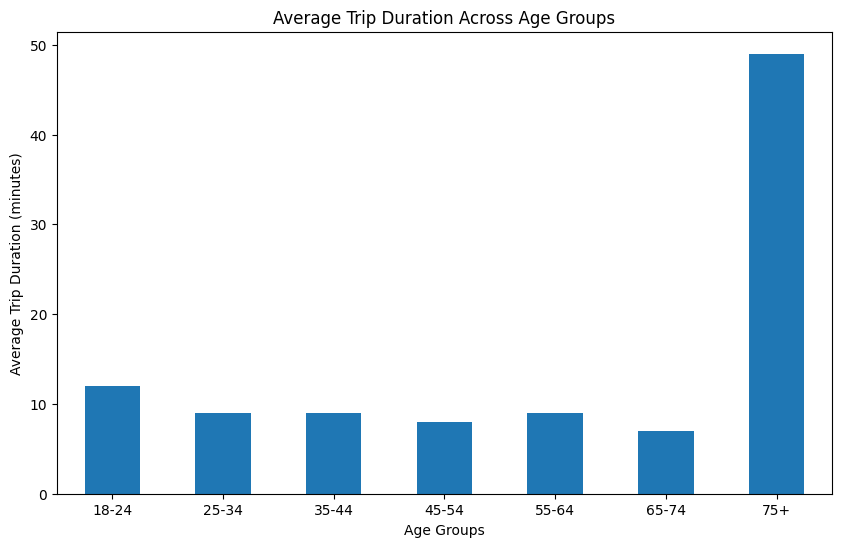

<p align="center">
  
</p>

# New York Citi Bikes — Exploratory Data Analysis

> Public Citi Bike trip data from the Jersey City service area, used here as a portfolio case study in exploratory analysis.

**98% of these bike rentals come from subscribers, and the busiest day is a Wednesday.**

That single fact reframes what the system actually is. A bike-share network that peaks midweek and empties out on weekends isn't a leisure product with a commuter side. It's commuting infrastructure with a small leisure tail.

The interesting question isn't *how many people ride*. It's what the shape of the data says about who they are — and which patterns in it are real signal versus artifacts of how the numbers were summarized.

Using 18,449 cleaned trips across 50 stations and 500 bikes, this analysis profiles rider behaviour, trip duration, and station demand — and corrects one summary statistic that points in exactly the wrong direction.

---

## Dataset

| Property | Value |
|---|---|
| Raw records | 20,400 |
| Records after cleaning | 18,449 |
| Date range | 2017-01-01 → 2017-12-03 |
| Stations | 50 |
| Unique bikes | 500 |
| Fields | 17 (timestamps, stations, user type, age, duration, weather, weekday) |

**Cleaning steps:** duplicate rows dropped, rows with missing values removed, `Trip_Duration_in_min` stripped of thousands separators and cast to numeric, timestamps parsed to datetime. Cleaning removed 1,951 rows (9.6% of the raw file).

---

## Investigation Approach

The analysis works through three stages:

1. **Data cleaning and descriptive statistics** — duplicates, missing values, type conversion, and distribution summaries for trip duration and rider age.
2. **Behavioural analysis** — station demand ranking, trip duration by age group, rental counts by age group, and the user type × weekday cross-tab.
3. **Visualization** — each finding rendered as a chart to confirm the pattern holds visually and isn't an artifact of aggregation.

Questions tested:

- Which stations carry the most demand?
- Does rider age predict how long someone rides?
- Which age groups actually use the system?
- How does demand split between subscribers and casual users across the week?

---

## Key Findings

### Finding 1 — Trip Duration Is Heavily Right-Skewed

| Metric | Trip Duration (min) | Age |
|---|---|---|
| Mean | 9 | 42 |
| Median | 5 | 39 |
| Min | 1 | 22 |
| Max | 3,693 | 90 |

The mean sits at nearly double the median. A 3,693-minute trip — more than 61 hours — is almost certainly an unreturned or mis-logged bike rather than a genuine ride.

This gap matters beyond a footnote. Any metric built on the mean of this column inherits that distortion, which is exactly what happens in Finding 3.

### Finding 2 — Demand Is Concentrated in a Few Stations

| Station | Rentals |
|---|---|
| Grove St PATH | 2,115 |
| Exchange Place | 1,224 |
| Sip Ave | 1,084 |
| Hamilton Park | 1,069 |
| Morris Canal | 710 |
| Newport PATH | 651 |
| City Hall | 576 |
| Van Vorst Park | 530 |
| Newark Ave | 510 |
| Warren St | 481 |

Grove St PATH alone accounts for 11% of all trips — nearly as many as the next two stations combined.

The top four stations share a defining trait: they are transit interchanges. Grove St PATH, Exchange Place, and Newport PATH are all PATH train stops. This is a last-mile network feeding rail, which means rebalancing bikes matters most where train schedules, not bike demand, set the rhythm.


### Finding 3 — The 75+ Age Group Statistic Is an Artifact

Grouping average trip duration by age produces one result that stands out sharply:

| Age Group | Mean Duration | Median Duration | Trips |
|---|---|---|---|
| 18-24 | 11.9 min | 10 min | 54 |
| 25-34 | 9.0 min | 6 min | 4,002 |
| 35-44 | 10.3 min | 5 min | 7,697 |
| 45-54 | 8.1 min | 5 min | 2,973 |
| 55-64 | 10.2 min | 6 min | 1,447 |
| 65-74 | 7.4 min | 6 min | 615 |
| **75+** | **47.9 min** | **4 min** | **55** |

Read by mean alone, riders aged 75+ take trips five times longer than anyone else — an eye-catching result that invites a story about leisurely retiree riding.

The median tells the opposite story. At 4 minutes, the 75+ group takes the **shortest** typical trip in the dataset.

The cause is a single 2,422-minute trip inside a group of only 55 records. One outlier in a small sample moves the mean by roughly 44 minutes; against 7,697 trips in the 35-44 group, the same outlier would be invisible.


This is the finding that would have survived into a slide deck unchallenged. It is worth stating plainly: **the 75+ result is not a behavioural insight, it is a sample-size artifact.**



### Finding 4 — Age Does Not Predict Trip Duration

Testing the relationship directly across all riders gives a correlation of **-0.002** between age and trip duration.

That is not a weak relationship — it is the absence of one. Trip length in this system is set by the journey being made, not by who is making it.


The scatter shows the same thing the correlation does: a dense band of short trips at every age, with scattered extreme values that follow no age pattern.

### Finding 5 — The System Runs on Commuters

Rentals split by user type and weekday:

| Weekday | Subscriber | One-time User | Total |
|---|---|---|---|
| Monday | 2,715 | 57 | 2,772 |
| Tuesday | 2,647 | 30 | 2,677 |
| **Wednesday** | **3,590** | **43** | **3,633** |
| Thursday | 3,239 | 20 | 3,259 |
| Friday | 2,645 | 30 | 2,675 |
| Saturday | 1,612 | 102 | 1,714 |
| Sunday | 1,651 | 68 | 1,719 |

Subscribers make up **98.12%** of rentals; one-time users just **1.88%**.

Average weekday volume (3,003 trips) runs 75% above the weekend average (1,716), peaking Wednesday. But the composition flips: Saturday carries the most one-time users of any day (102) while carrying the fewest total trips.

Weekdays and weekends are serving two different populations, not one population riding at different rates.


### Finding 6 — Ridership Concentrates in Mid-Career Ages

| Age Group | Rentals |
|---|---|
| 35-44 | 7,697 |
| 25-34 | 4,002 |
| 45-54 | 2,973 |
| 55-64 | 1,447 |
| 65-74 | 615 |
| 75+ | 55 |
| 18-24 | 54 |

The 25-54 range accounts for 79% of all rentals. Riders under 25 are nearly absent — 54 trips out of 18,449 — which is notable for a system in a dense urban area and consistent with a subscriber base built around full-time commuting.


---

## Recommendations

| Priority | Recommendation | Rationale |
|---|---|---|
| High | Prioritize rebalancing capacity at Grove St PATH, Exchange Place, and Sip Ave | Top 3 stations carry 24% of all trips |
| High | Align rebalancing schedules to weekday commute peaks, especially Wednesday and Thursday | Weekday volume runs 75% above weekends |
| Medium | Target casual-rider acquisition at weekends, when one-time usage already concentrates | Saturday has peak casual users but lowest total volume |
| Medium | Report trip duration using medians, with outlier handling defined | Mean is distorted by unreturned-bike records |
| Low | Investigate the under-25 gap as a pricing or awareness question | 54 trips is far below population share |

Deliberately **not** recommended: age-segmented product or marketing changes. With a correlation of -0.002 between age and trip duration, and the 75+ signal explained by one outlier, this dataset provides no basis for treating age groups as behaviourally distinct.

---

## Technical Highlights

- Data cleaning: duplicate removal, missing-value handling, type coercion on malformed numeric strings
- Datetime parsing and temporal feature use (weekday, month, season)
- Descriptive statistics and distribution analysis
- Outlier detection and its effect on grouped aggregates
- Grouped aggregation and cross-tabulation (`groupby`, `unstack`, styled tables)
- Correlation analysis
- Data visualization: bar, horizontal bar, area, and scatter plots

**Tools:** Python • pandas • Matplotlib • Jupyter Notebook

---

## Repository

```bash
git clone https://github.com/niksaderek/New-York-Citi-Bikes-EDA.git
cd New-York-Citi-Bikes-EDA
pip install pandas matplotlib
jupyter notebook notebook.ipynb
```

The notebook reproduces every statistic and chart in this case study from the raw CSV.

```
.
├── notebook.ipynb                              # Full analysis
├── New York Citi Bikes_Raw Data - NYCitiBikes.csv   # Raw dataset (20,400 rows)
├── bikes_dataset.csv                           # Cleaned dataset
└── docs/images/                                # Charts
```

---

## Final Thought

The headline number in this dataset — 75+ riders taking 48-minute trips — is wrong.

Not miscalculated. The arithmetic is correct. It's wrong because a mean over 55 records with one 40-hour outlier doesn't describe anyone's behaviour, and the median sitting at 4 minutes proves it.

Exploratory analysis isn't about producing the most interesting number. It's about knowing which numbers are load-bearing before anyone builds a decision on top of them.
